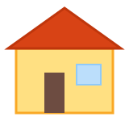

#+STARTUP: inlineimages

* SVG test

#+begin_src xml :tangle house.svg
<svg xmlns="http://www.w3.org/2000/svg"
     viewBox="390 260 160 150">
  <g id="house1">
    <rect x="410" y="320" width="120" height="80"
          fill="#FFE082" stroke="#F9A825" stroke-width="3"/>
    <polygon points="400,320 470,270 540,320"
             fill="#D84315" stroke="#BF360C" stroke-width="3"/>
    <rect x="445" y="350" width="25" height="50"
          fill="#6D4C41"/>
    <rect x="485" y="340" width="30" height="25"
          fill="#BBDEFB" stroke="#90CAF9" stroke-width="2"/>
  </g>
</svg>
#+end_src

